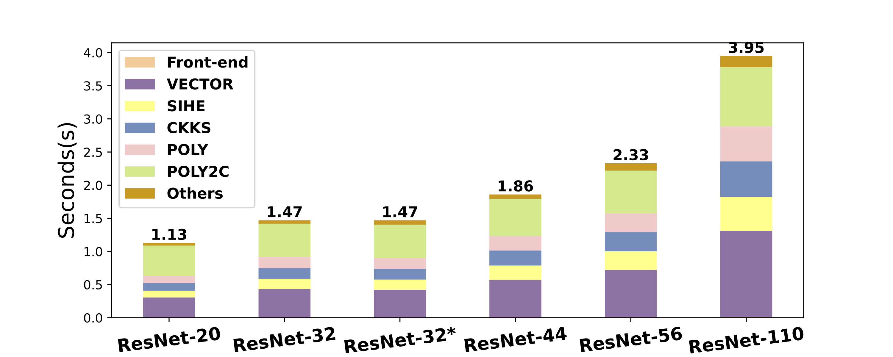

**ACE** is a Fully Homomorphic Encryption (FHE) Compiler Framework for automating Neural Network (NN) Inference. ACE takes pre-trained ONNX model as input and direcltly generating C/C++ programs to perform NN inference on encrypted data.

# Introduce ACE

FHE stands as a revolutionary cryptographic technology that allows computations to be directly carried out on encrypted data without ever requiring decryption. This powerful technique facilitates the manipulation of secret data to ensure the computing party remains blind to the actual information, yet can deliver a valuable encrypted output.

<i>Decrypt(Homo_Add(Encrypt(a), Encrypt(b))) == Add(a, b)</i>

<i>Decrypt(Homo_Mult(Encrypt(a), Encrypt(b))) == Mult(a, b)</i>

**ACE** is designed for Privacy-Preserving Machine Learning (PPML) Inference Applications. In this scenario, the ML inference is deployed in the cloud and clients upload their input data to cloud and receive the inference output from the service. In conventional ML inference services, data and results are often transferred in plaintext. This practice leaves sensitive information vulnerable to privacy breaches. Symmetric Encryption can protect the privacy during data transmission. But it can't stop privacy leaks within the cloud infrastructure, where the service provider might access the data inadvertently or with malicious intent. With homomorphic encryption, ML inference can be performed directly on encrypted user data. This ensures that sensitive user data is protected against unauthorized access at all stages of the cloud-based inference service.

**ACE** takes pre-trained ML model as input and compile it into FHE program directly for both server side and client side. This makes ACE can be easily integrated into any existing ML framework like ONNX, PyTorch, TensorFlow ans others. In this way, the development of FHE application is greatly simplified. Developer won't need to study the mathematics foundations of FHE, APIs of FHE libraries and get rid of tedious details of parameter selection, FHE specific operation insertion, noise and scale management, bootstrapping insertion, etc.

**ACE** has a 5-levels of IR to compile the pre-trained ML model with Tensor types and operations into low-level Polynomial type and operations. Each phase takes input from predecessor, translate types and operations specific to higher level into current level. Analyzations and optimizations may be taken place both before and after the translation pass.

# Evaluate ACE

We evaluated ACE with ResNet, a typical DNN network for image recognition. The test suite is CIFAR. Pre-trained models like ResNet20/32/44/56, were directly downloaded from GitHUB. ResNet110 is trained from scratch with CIFAR training set. The experiments were done in a Docker container (version 25.0.1) on a Linux server (Ubuntu Linux 20.04 LTS) with an Intel Xeon Platinum 8369B CPU @2.70GHz and 512 GB memory.

Compile time is measured on different size of ResNet model:

Runtime performance to infer 1 image with single thread (left bar) and compared with ICML'22 FHE-MP-CNN (right bar) https://github.com/snu-ccl/FHE-MP-CNN:

Runtime memory consumption to infer 1 image with single thread (left bar) and compared witn ICML'22 FHE-MP-CNN (righr bar):

Inference accuracy on first 1000 images in CIFAR-10 or CIFAR-100 test suite:

  <table>
    <tr><th>Model</th><th>Unencrypted</th><th>Encrypted</th></tr>
    <tr><td>ResNet20</td><td>90.9%</td><td>91.2%</td></tr>
    <tr><td>ResNet32</td><td>92.8%</td><td>92.8%</td></tr>
    <tr><td>ResNet32-CIFAR100</td><td>66.4%</td><td>65.9%</td></tr>
    <tr><td>ResNet44</td><td>92.5%</td><td>90.7%</td></tr>
    <tr><td>ResNet56</td><td>93.9%</td><td>93.8%</td></tr>
    <tr><td>ResNet110</td><td>94.0%</td><td>93.4%</td></tr>
  </table>

# Try ACE

## Hardware and software prerequisite

To compile ACE, x86-64 based system is required.
*    x86_64 CPU with 4 cores or above
*    8 GB or above memory
*    10 GB or more disk space

To run ResNet compiled by ACE, x86-64 with larger memory and disk space is required.
*    x86_64 CPU with 4 cores or above
*    128 GB or above memory
*    40 GB or more disk space

To speed up the accuracy test, CPU with 32 or above cores, 256 GB or above  memory are highly recommended.

We provide Dockerfile to simplify setting up the software developing and testing environment. Docker must be supported by host OS. Ubuntu Linux 20.04 LTS is recommended to run the docker to try ACE compiler.

Follow steps listed in <a href="https://github.com/ace-compiler/ace-compiler/blob/main/README.md">README.md</a> to build and test ACE Compiler.

Enjoy!

